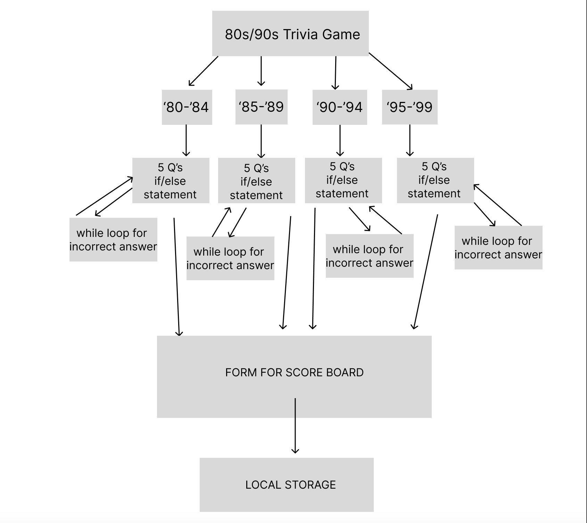

# 201-project

## Emily Greason.

## Christina Hollie.

## Julio Ramirez.

## Lacey Washington.

SynataxSorcerers

**Cooperation Plan**

 1.These are the key strengths for each individual. Emily and Christina feel like we are better at CSS and Lacey and Julio feel that they are better at JavaScript, but we all want to get better in our weaker areas.

 2.Emily wants to contribute to JavaScript and lend a helping hand with CSS because that is her strength. Same for Christina and Lacey likes to prioritize functionality over looks but wants to work on bettering his CSS skills. Julio wants to help make sure we are all feeling included and can help with JavaScript as well.

3.Christina and Emily want to strengthen there abilities in JavaScript, Lacey wants to hone his skills in CSS and Julio also wants to have a better styling abilities and his functions in JavaScript.

4.Approaching day to day work we plan on communicating and working on our individual branches and then reviewing each others code to determine what we want to add to main.

**Conflict Plan**

1.When resolving conflict we plan to have patience and understanding of each others skills and also accountability for our own work and how we are interacting with each other.

2.If we feel someone is taking over the project we will address that person and figure out how we can all have a voice in what's being done.

3.When there is a skill level challenge we will make sure we are effectively communicating our thoughts and feelings with one another to make sure we are staying on track and also that we are open to each others feedback.

4.If someone isn't adequately contributing we will also address that person and see if there is anyway we can help them.

5.When approaching escalating conflict we will go to whoever directly and offer assistance, ask what is needed and figure out what we all can do to make sure we stay on course.

**Communication Plan**

1.We will be working class hours and if there are emergencies and we are needing to catch up then we will work on things Friday. Sunday are our days off and if anyone decides they are wanting to work on things then they will communicate that with the group.

2.We will communicate with each other via text or Slack.

3.We will take a 10-15min break every hour.

4.Fridays are extra days we can add if we feel like we are falling behind.

5.After hours we are all available via text and have agreed to respond as soon as we are able.

6.We will ensure everyone's voice is being heard by making sure we agree to communicate our needs.

7.We will create a safe space by being patient and kind to each other.

**Scheduling the practice section**
Contacted instructor

**Git Process**

1.When identifying tasks at hand we will assign each of us something to complete and then have a test branch and personal branches that we will each push to the test branch. Then when we all agree on how the test branch looks we will add to main. We will discuss this on Saturdays.

2.We will be using the GitHub Projects management tool.

3.We will have a test branch and personal branches that we will each push to the test branch. Then when we all agree on how the test branch looks we will add to main. We will discuss this on Saturdays.

[Final Project Deck](https://docs.google.com/presentation/d/10BC2bCONo29nRvEOzpWXe0F7qEMH2ANHrQSsJjj1joc/edit?usp=sharing_eil_se_dm&ts=64224789)

**User Stories**

### Harry Bronson
As a Trivia game enthusiast, I want a game that requires a fill in the blank trivia game to impress my friends and add a challenge to our movie night trivia night.
### Julia Clark 
As a manager for a small business it’s important to have a team that can work together and compile there shard knowledge together. Having a movie trivia game is a good way to foster camaraderie among my staff.
### Tom Shen
As a father to three teenagers its important for me and my husband to keep our family close and grounded so having weekly game nights is important part of our family dynamic with 90s movie trivia it a good way to show our kids our culture from when I was growing up and bring us closer together and even watch a few after.
### Marcus White 
As a film professor I think 90s were a turning point to how we made movie using movie madness is a good way to test my students.

## SOURCED CODE

[CSS animation generator](https://webcode.tools/generators/css/keyframe-animation?utm_content=cmp-true)

[Interactive Tv With Pure CSS](https://www.youtube.com/watch?v=rdjub7lr4C8)
